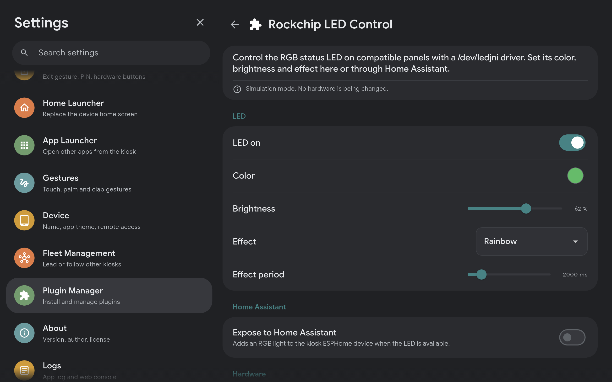

# Rockchip LED Control for Kiosk Satellite

Control the front RGB status LED on Android panels that expose the vendor `/dev/ledjni` driver. The plugin provides a color picker, brightness control, 25 effects (24 of them selectable from Home Assistant, plus "None" on the plugin's own Settings screen — see below) and an optional Home Assistant RGB light through Kiosk Satellite's ESPHome connection.

Rockchip chipset branding alone does not establish compatibility. This plugin implements the protocol described by [David Coulson in Kiosk Satellite issue #494](https://github.com/jxlarrea/kiosk-satellite/issues/494), with credit to [maxlyth/ha-paneld](https://github.com/maxlyth/ha-paneld) for the original vendor protocol research. It is an independent implementation and includes no vendor binaries or copied fork implementation.



## Requirements

- Kiosk Satellite with **plugin SDK 1 support**. All plugin features use SDK 1, the first public API.
- Android 7.0 or newer on arm64-v8a, armeabi-v7a or x86_64.
- A compatible `/dev/ledjni` driver that permits direct access, or a rooted panel with an approved `su` helper path.
- For Home Assistant control, enable Kiosk Satellite's ESPHome connection and native entities and add that device to Home Assistant.

The default configuration leaves the LED off and root fallback disabled. Hardware access failures appear inside the plugin subpage. The plugin does not root the panel, change permissions or modify SELinux policy.

## Install and use

1. Wait for a stable GitHub release and its GitHub Actions build to complete.
2. Open **Plugin Manager > Add plugin**, paste this repository URL, review the manifest and README and choose **Trust and install**.
3. Enable **Rockchip LED Control** on its entry row and open the subpage.
4. Check the hardware status. Adjust **LED on**, **Color**, **Brightness** and **Effect**. Changes save automatically and sliders save when released.
5. Use the **Rockchip LED** light in Home Assistant for everyday control and automations.

The plugin also declares **Check hardware access**, **Test red, green and blue** and **Turn LED off** actions. Assign them in Gestures or open their action rows to add a kiosk drawer shortcut or Home Assistant button. The settings page configures these connections instead of running actions. The three-second channel test respects brightness and the maximum drive setting and returns to the configured state afterward.

Normal installation uses the repository URL and GitHub Actions release assets. Manually uploaded release assets are rejected. **Developer Tools > Install from ZIP** is for developers testing their own local builds only. The entry row offers update checking and a README information modal. Updates stop and resume enabled plugins automatically. Disabling or uninstalling the plugin stops effects and attempts to turn the LED off.

## Controls

| Setting | Behavior |
| --- | --- |
| LED on | Enables physical output independently of the plugin master switch |
| Color | Base RGB color used by static output and color-based effects |
| Brightness | Scales output from 0 to 100 percent |
| Effect | None, Pulse, Blink, Rainbow, Candle, Random, Sunrise/Sunset, Moonlight Glow, Lightning Storm, Wake-Up Alarm, Candle Flicker, Fairytwinkle, Fireworks Burst, Beacon Pulse, Heartbeat Pulse, Soft Glow, Rolling Fog (Pronounced), Pacifica (Calm Lagoon/Storm/Deep Current), Aurora (Solar Storm/Pastel Dream/Red Sky), Bubbles or Disco Sparkle — the last 19 ported from [davidcoulson/kiosk-satellite](https://github.com/davidcoulson/kiosk-satellite) |
| Effect period | Controls the cycle length for Pulse, Blink, Rainbow and Random. Candle uses its own flicker timing |
| Expose to Home Assistant | Publishes an RGB light only while access is available |
| Maximum channel drive | Maps a full channel to 1 through 255. Defaults to 15 pending calibration on the actual panel |
| Allow root fallback | Allows the fixed LED helper through `su` when direct access is denied |
| Simulation mode | Exercises controls and effects without touching hardware. The HA light name explicitly identifies simulation |

The 0 to 15 default follows the conservative range in the original research. It is not a universal calibration or a hardware safety guarantee. Different panels can respond differently. See [hardware verification](docs/hardware-verification.md) before raising it.

## Home Assistant

The light appears under the existing Kiosk Satellite ESPHome device. It supports on/off, RGB color, brightness and 24 of the 25 effects — Kiosk Satellite's plugin host caps a published light at 24 effects, so "None" (solid color, no animation) is left out of the Home Assistant dropdown; it's still available from the plugin's own on-device Settings screen, and the host accepts it if sent programmatically even though it isn't listed. Commands update the plugin's saved settings, so the subpage and Home Assistant use the same configuration. State reports the last applied command, not independent hardware readback.

Turning **Expose to Home Assistant** on or off, gaining or losing device access and disabling the plugin changes the entity catalog. KS briefly reconnects ESPHome to advertise that change. Ordinary color, brightness and effect changes do not reconnect ESPHome or restart the kiosk.

## Build and test

On Linux, install Python 3, JDK 21, a C compiler and an Android SDK with a platform, build-tools and NDK. The development build was tested with NDK `28.2.13676358`.

```sh
export JAVA_HOME=/path/to/jdk-21
export ANDROID_HOME=/path/to/android-sdk
python3 tools/test.py
python3 tools/build.py
```

The output in `dist/` contains the ZIP, its SHA-256 file, the release manifest and a compile-time SDK JAR. The ZIP contains the manifest, DEX JAR, license and native libraries for all three supported ABIs. The SDK classes are not bundled into the plugin JAR.

GitHub Actions runs these tests and builds when a release is published and attaches the ZIP, checksum and manifest to that release. Commits and pull requests do not trigger builds. Manual runs are available on existing release tags. See [release instructions](docs/maintainer-handoff.md#release).

Tests cover channel scaling, effects, lifecycle cleanup, simulated HA commands and the exact native ioctl sequence using fake system calls. They do not prove compatibility with a physical panel. See [initial verification results](docs/verification-results.md) for the completed checks. The initial physical verification must happen on a compatible device. See [hardware verification](docs/hardware-verification.md).

## Publishing and handoff

See [maintainer handoff](docs/maintainer-handoff.md) for repository ownership, releases and the transfer checklist. This repository is Apache-2.0. The plugin ID is `rockchip-led-control` and should stay stable when ownership changes.

Author: David Coulson. Built with AI assistance (Claude Code).

The plugin and vendored interfaces use SDK 1. This LED plugin does not request `host.read` or `host.control`. See the [complete KS interaction reference](https://github.com/jxlarrea/kiosk-satellite-plugin-hello-world/blob/main/docs/ks-api.md) for optional state queries, events and transient controls.
